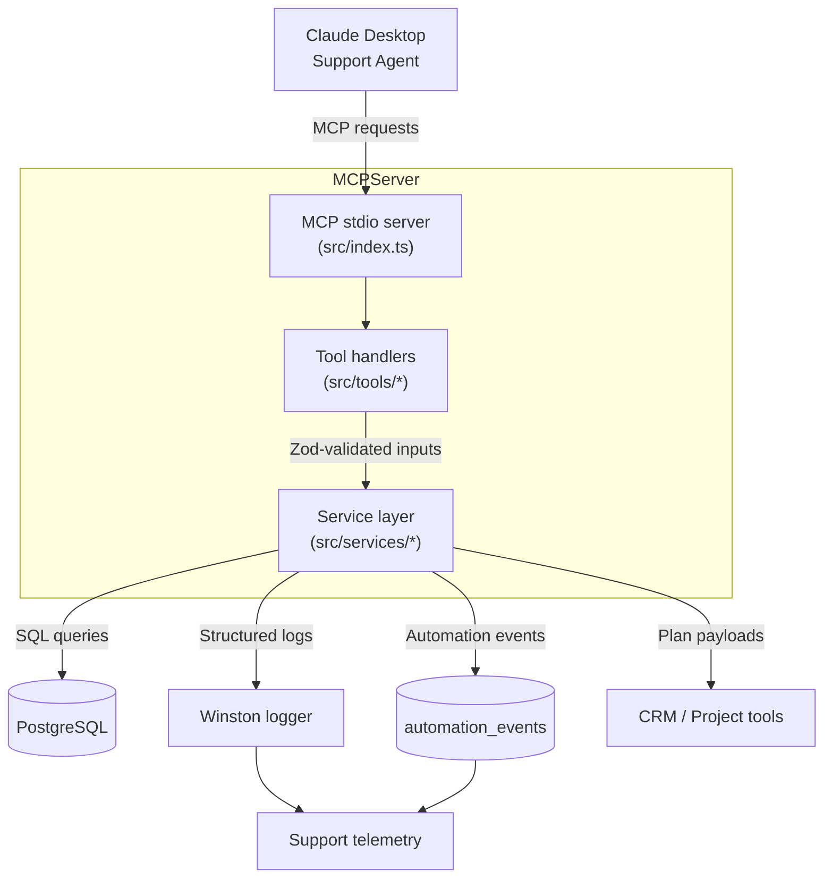
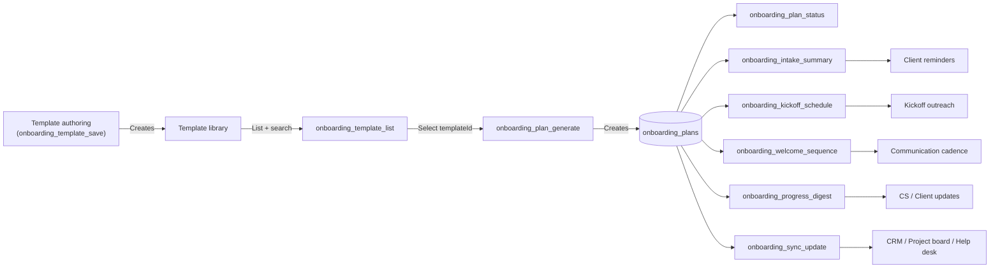

# Client Onboarding Agent MCP

AI-powered onboarding coordinator for solopreneurs and boutique agencies. This MCP server helps you spin up tailored onboarding plans, chase intake deliverables, and keep every system in sync during the critical first weeks of a new engagement.

## Features

- **Template Library** – Reusable onboarding playbooks grouped by service, industry, or tier.
- **Intake Automation** – Generates checklists, forms, and document requests to unblock kickoff.
- **Kickoff Coordination** – Prepares availability summaries and call prompts ready for copy/paste.
- **Welcome Sequences** – Drafts multi-touch communications for the first week of the relationship.
- **Progress Digests** – Summaries for internal standups or client updates highlighting blockers.
- **System Sync** – Emits structured payloads for CRMs, project tools, or support systems.

## Architecture

- **Transport** – Model Context Protocol (stdio) server built with TypeScript and `@modelcontextprotocol/sdk`.
- **Database** – PostgreSQL schema managed via `scripts/setup-database.ts`; tables cover templates, plans, steps, intake, and automation events.
- **Service Layer** – `src/services/*` modules encapsulate business logic with strict Zod validation from `src/types/onboarding.ts`.
- **Logging & Telemetry** – Winston logger (`src/utils/logger.ts`) emits structured JSON; automation events are recorded in `automation_events` for downstream ingestion.
- **Tool Adapters** – `src/tools/*` expose MCP tool handlers that orchestrate service calls and shape machine-friendly responses.



## Prerequisites

- Node.js 18 or newer.
- PostgreSQL database (Neon free tier recommended).
- Claude Desktop with MCP support enabled.
- `.env` file populated with connection details.

## Environment

- `DATABASE_URL` (required) – PostgreSQL connection string.
- `LOG_LEVEL` – Defaults to `info`; set `debug` for verbose troubleshooting.
- `PG_POOL_MAX` – Connection pool size (default `10`).
- `PG_IDLE_TIMEOUT_MS` – Idle connection timeout (default `10000`).
- `PG_CONNECTION_TIMEOUT_MS` – Connection acquisition timeout (default `10000`).
- `MOCK_SUPPORT_AGENT` – Shared flag; safe to leave unset here.

Copy `.env.example` to `.env` and adjust the values before running locally.

## Quick Start

```bash
cd client-onboarding-agent
npm install
npm run db:setup
npm run dev
```

## MCP Server Registration

Add the server to `claude_desktop_config.json`:

```json
{
  "mcpServers": {
    "client-onboarding-agent": {
      "command": "node",
      "args": [
        "D:/projects/Lead gen app/client-onboarding-agent/dist/index.js"
      ],
      "env": {
        "DATABASE_URL": "your-neon-database-url"
      }
    }
  }
}
```

Restart Claude Desktop and run the smoke test to validate the workflow:

```bash
npm run test:smoke
```

Clean up artifacts when you are done:

```bash
npm run db:cleanup
```

## Scripts & Testing

- `npm run db:setup` – Creates schema and seed data for smoke testing.
- `npm run db:cleanup` – Removes smoke-test artifacts so reruns stay clean.
- `npm run dev` – Starts the MCP server with `tsx` for local development.
- `npm run build` – Emits compiled JavaScript into `dist` for deployment.
- `npm run test` – Runs Vitest unit suite (`src/services/__tests__`).
- `npm run test:smoke` – Executes the full MCP workflow via `scripts/test-onboarding-tools.ts`.

CI/CD reminder: both `test` and `test:smoke` should pass before publishing a new bundle for the Core Support agent.

## MCP Tools

| Tool                          | Purpose                                                     | Key Inputs                                                                | Output Snapshot                                                    |
| ----------------------------- | ----------------------------------------------------------- | ------------------------------------------------------------------------- | ------------------------------------------------------------------ |
| `onboarding_template_list`    | Paginate organization + global templates.                   | `userId`, optional `category`, `search`, `limit`, `offset`.               | `{ total, templates: [{ id, name, stages, intakeRequirements }] }` |
| `onboarding_template_save`    | Upsert templates and ensure consistent metadata.            | `userId`, `template` payload.                                             | Normalized template record with generated ID.                      |
| `onboarding_plan_generate`    | Create a plan from a template and record automation events. | `userId`, `templateId`, `client`, optional `owner`, `kickoffPreferences`. | Plan status bundle (`plan`, `steps`, `intake`).                    |
| `onboarding_plan_status`      | Fetch live progress with computed completion percentage.    | `planId`.                                                                 | `{ plan, steps, intake }`, progress patched if stale.              |
| `onboarding_intake_summary`   | Draft customer-facing reminders.                            | `planId`, optional `tone`, `includeCompleted`.                            | Markdown digest of outstanding items.                              |
| `onboarding_kickoff_schedule` | Reconcile availability blocks for a kickoff.                | `planId`, `teamAvailability[]`, `clientAvailability[]`.                   | Suggested time slots + outreach copy.                              |
| `onboarding_welcome_sequence` | Compose first-week communications.                          | `planId`, optional `communicationMode`.                                   | Array of touches with timing, subject, body.                       |
| `onboarding_progress_digest`  | Summarize wins, blockers, and next actions.                 | `planId`.                                                                 | Digest keyed by internal vs client audience.                       |
| `onboarding_sync_update`      | Emit integration payloads for downstream systems.           | `planId`, `system`.                                                       | `{ planId, system, payload }` for CRMs or ticketing.               |

Schema validation lives in `src/types/onboarding.ts`; refer to tool implementations under `src/tools/` for field-level details.



## Observability & Runbooks

- **Structured Logs** – Winston outputs JSON with level, message, and metadata. Set `LOG_LEVEL=debug` to inspect SQL filters, pagination, and plan reconciliation flows.
- **Automation Events** – `automation_events` table captures lifecycle hooks (e.g., `plan_generated`). Pipe this into analytics or the Support agent to expose onboarding context.
- **Troubleshooting** –
  - `Plan not found` typically means an obsolete ID; regenerate or confirm cleanup scripts did not purge the plan.
  - Empty template lists usually imply mismatched `userId`; align UUIDs from the Core Support agent session.
  - Connection timeouts indicate Neon/DB access issues; verify connection string and allowlist.
- **Data Hygiene** – Run `npm run db:cleanup` after smoke tests so historical telemetry stays trustworthy.

## Integration Notes

- The Support agent consumes these tools; descriptive template names and metadata accelerate case resolution.
- `onboarding_sync_update` payloads mirror CRM-friendly fields (`status`, `kickoffTarget`, `outstandingIntake`). Paste them into tickets for rapid CS responses.
- Extend `recordAutomationEvent` in `src/services/plan-service.ts` when adding new lifecycle hooks (billing handoff, NPS outreach, etc.).

## Reference

- Entry point: `src/index.ts`
- Database helpers: `src/db/client.ts`
- Type definitions: `src/types/onboarding.ts`
- Unit tests: `src/services/__tests__/plan-and-template-service.test.ts`
- Smoke harness: `scripts/test-onboarding-tools.ts`

Questions or extensions? Reach the Forge CS engineering channel and share relevant automation event IDs for tracing.
